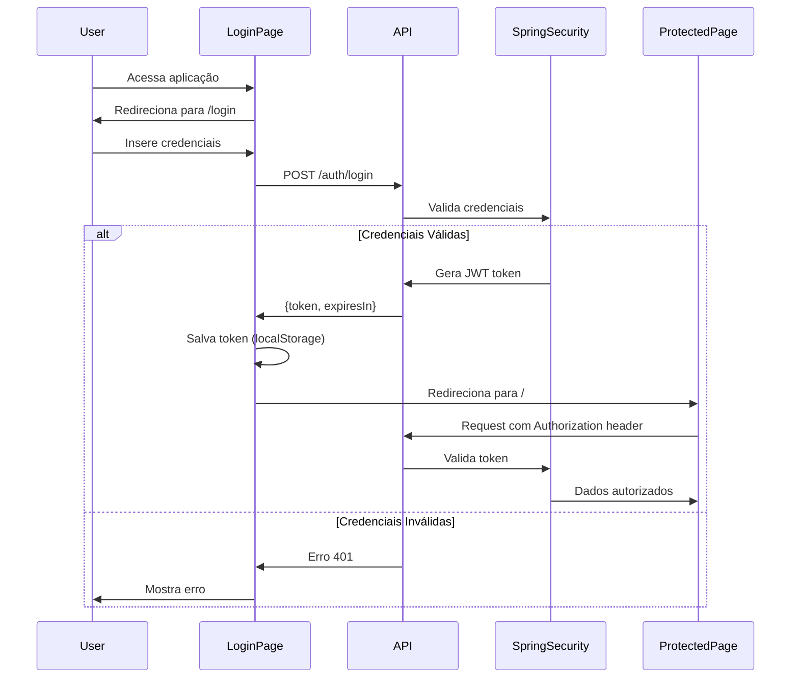

# Sistema de Autenticação JWT

Este documento descreve o sistema de autenticação implementado no CPSystem.

## Visão Geral

O sistema utiliza JWT (JSON Web Tokens) para autenticação com:
- **Backend**: Spring Security + JWT
- **Frontend**: Next.js com guards de autenticação client-side
- **Credenciais**: Armazenadas em variáveis de ambiente

## Configuração

### 1. Variáveis de Ambiente

#### Backend (arquivo `.env` na raiz do projeto)

```bash
# Credenciais do usuário padrão
AUTH_USER_EMAIL=admin@example.com
AUTH_USER_PASSWORD=sua_senha_segura_aqui

# Configuração JWT
JWT_SECRET=chave_secreta_jwt_minimo_32_caracteres_gerar_aleatoria
JWT_EXPIRATION_MS=3600000  # 1 hora em milissegundos
```

**Importante**: Gere uma chave JWT segura com:
```bash
openssl rand -base64 32
```

#### Frontend (arquivo `frontend/.env.local`)

```bash
# URL da API (desenvolvimento - sem /api, produção - com /api que o Nginx remove)
NEXT_PUBLIC_API_URL=http://localhost:8080/v1
```

### 2. Iniciar os Serviços

#### Backend
```bash
cd backend
./mvnw spring-boot:run
```

O backend estará disponível em `http://localhost:8080`

#### Frontend
```bash
cd frontend
npm install  # primeira vez
npm run dev
```

O frontend estará disponível em `http://localhost:3000`

## Como Usar

### 1. Primeiro Acesso

1. Acesse `http://localhost:3000`
2. Você será redirecionado para `/login`
3. Use as credenciais configuradas nas variáveis de ambiente:
   - Email: valor de `AUTH_USER_EMAIL`
   - Senha: valor de `AUTH_USER_PASSWORD`

### 2. Navegação

Após o login bem-sucedido:
- O token JWT é armazenado no localStorage do navegador
- Todas as requisições à API incluem automaticamente o token
- Você tem acesso a todas as páginas protegidas

### 3. Logout

Clique no ícone de logout (🚪) na barra lateral:
- Desktop: Ícone no canto inferior da sidebar
- Mobile: Item "Sair" no menu hamburguer

## Arquitetura

### Backend

```
backend/src/main/java/dev/gustavorosa/cpsystem/
├── security/
│   ├── JwtTokenProvider.java         # Gera e valida tokens JWT
│   ├── JwtAuthenticationFilter.java  # Intercepta requests
│   ├── SecurityConfig.java           # Configuração Spring Security
│   ├── AuthController.java           # Endpoint /auth/login
│   └── dto/
│       ├── LoginRequest.java         # DTO de entrada
│       └── AuthResponse.java         # DTO de saída (token)
```

**Endpoints:**
- `POST /api/v1/auth/login` - Login (público)
- `GET /api/v1/auth/validate` - Valida token (requer auth)
- Todos os outros endpoints requerem autenticação

### Frontend

```
frontend/
├── app/
│   ├── login/
│   │   └── page.tsx                  # Página de login
│   └── layout.tsx                    # Layout com auth wrapper
├── components/
│   ├── auth-guard.tsx                # Guard de autenticação
│   ├── auth-layout-wrapper.tsx       # Wrapper condicional
│   └── sidebar/
│       └── index.tsx                 # Sidebar com logout
├── lib/
│   ├── auth.ts                       # Funções de autenticação
│   └── api.ts                        # Cliente API com JWT
└── middleware.ts                     # Middleware Next.js
```

## Fluxo de Autenticação



## Segurança

### Boas Práticas Implementadas

1. **Senhas Fortes**: Use senhas com mínimo 16 caracteres
2. **JWT Secret**: Chave de 32+ caracteres aleatórios
3. **Expiração de Token**: 1 hora por padrão
4. **HTTPS em Produção**: Configure SSL/TLS
5. **Variáveis de Ambiente**: Credenciais nunca no código

### Proteção de Rotas

- **Backend**: Spring Security protege todos os endpoints exceto `/auth/login`
- **Frontend**: `AuthGuard` verifica token antes de renderizar páginas
- **API Client**: Intercepta erro 401 e redireciona para login

### Tokens

- **Formato**: Bearer Token no header `Authorization`
- **Algoritmo**: HMAC-SHA256
- **Conteúdo**: Email do usuário no subject
- **Validação**: Em cada requisição ao backend

## Solução de Problemas

### Erro: "Sessão expirada"

O token JWT expirou (padrão: 1 hora). Faça login novamente.

### Erro: "Credenciais inválidas"

Verifique:
1. Variáveis de ambiente no backend estão corretas
2. Email e senha correspondem aos valores no `.env`
3. Backend está rodando

### Erro: "Failed to fetch"

Verifique:
1. Backend está rodando em `localhost:8080`
2. `NEXT_PUBLIC_API_URL` está correto no frontend
3. CORS está configurado corretamente

### Token não está sendo enviado

Verifique:
1. Token está no localStorage: F12 → Application → Local Storage
2. Funções de `lib/api.ts` usam `getAuthHeaders()`

## Expansão Futura

Para adicionar mais funcionalidades:

### Múltiplos Usuários

1. Crie tabela `users` no banco:
```sql
CREATE TABLE users (
    id SERIAL PRIMARY KEY,
    email VARCHAR(255) UNIQUE NOT NULL,
    password_hash VARCHAR(255) NOT NULL,
    role VARCHAR(50) DEFAULT 'USER'
);
```

2. Use BCrypt para hash de senhas
3. Implemente `UserDetailsService` no Spring
4. Adicione endpoint de registro (opcional)

### Roles e Permissões

1. Adicione campo `role` no token JWT
2. Use `@PreAuthorize` nos controllers
3. Implemente verificação no frontend

### Refresh Tokens

1. Crie endpoint `/auth/refresh`
2. Armazene refresh token separado
3. Implemente renovação automática

## Referências

- [Spring Security Documentation](https://spring.io/projects/spring-security)
- [JWT.io](https://jwt.io/)
- [Next.js Authentication](https://nextjs.org/docs/authentication)
- [Shadcn UI Components](https://ui.shadcn.com/)
