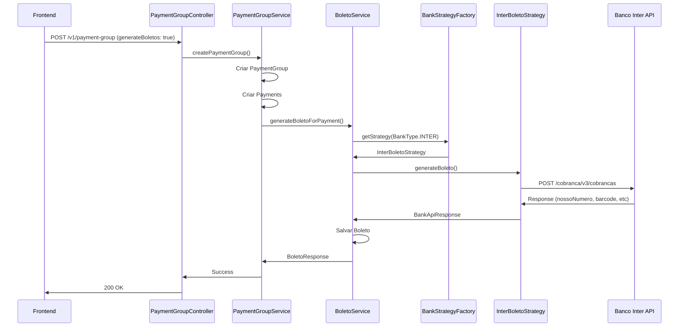

# Integração com Banco Inter - Geração de Boletos

## ✅ Implementação Concluída

A integração completa com a API do Banco Inter para geração automática de boletos foi implementada com sucesso utilizando o padrão Strategy, permitindo fácil expansão para outros bancos no futuro.

## 🏗️ Arquitetura Implementada

### Backend (Spring Boot)

```
backend/src/main/java/dev/gustavorosa/cpsystem/
├── boleto/
│   ├── model/
│   │   ├── Boleto.java              # Entidade JPA
│   │   ├── BoletoStatus.java        # Enum de status
│   │   └── BankType.java            # Enum de bancos
│   ├── dto/
│   │   ├── BoletoRequest.java       # DTO de request
│   │   ├── BankApiResponse.java     # DTO de response da API
│   │   └── BoletoResponse.java      # DTO de response público
│   ├── service/
│   │   ├── BoletoService.java       # Service principal
│   │   └── strategy/
│   │       ├── BankBoletoStrategy.java      # Interface Strategy
│   │       ├── InterBoletoStrategy.java     # Implementação Banco Inter
│   │       └── BankStrategyFactory.java     # Factory de estratégias
│   ├── repository/
│   │   └── BoletoRepository.java    # Repository JPA
│   ├── controller/
│   │   └── BoletoController.java    # REST Controller
│   ├── config/
│   │   └── InterRestClientConfig.java       # Configuração SSL
│   └── exception/
│       ├── BoletoGenerationException.java
│       ├── BoletoAlreadyExistsException.java
│       └── BankNotSupportedException.java
```

### Frontend (Next.js)

- ✅ Checkbox para geração de boletos em `/payment-groups/new`
- ✅ API client atualizado com suporte a `generateBoletos`
- ✅ Tipos TypeScript para `BoletoResponse`

### Banco de Dados

- ✅ Migration `V6__create_boletos_table.sql` criada
- ✅ Tabela `boletos` com relacionamento 1:1 com `payments`
- ✅ Índices para otimização de queries

## 🚀 Como Usar

### 1. Configurar Credenciais do Banco Inter

Adicione as seguintes variáveis ao arquivo `.env`:

```bash
# Banco Inter API Configuration
INTER_CLIENT_ID=seu_client_id_aqui
INTER_CLIENT_SECRET=seu_client_secret_aqui
INTER_CERTIFICATE_PATH=classpath:certs/inter-cert.p12
INTER_CERTIFICATE_PASSWORD=senha_do_certificado
```

### 2. Obter Certificado Digital

1. Acesse o portal do Banco Inter para desenvolvedores: https://developers.bancointer.com.br/
2. Cadastre sua aplicação e obtenha as credenciais (Client ID e Client Secret)
3. Faça o download do certificado digital em formato `.p12`
4. Coloque o certificado em: `backend/src/main/resources/certs/inter-cert.p12`

### 3. Aplicar Migration

Execute a aplicação para que o Flyway aplique automaticamente a migration `V6`:

```bash
cd backend
./mvnw spring-boot:run
```

### 4. Usar no Frontend

Ao criar um novo grupo de pagamentos:
1. Preencha o formulário normalmente
2. Marque o checkbox "Gerar boletos automaticamente"
3. Clique em "Criar Grupo"
4. Os boletos serão gerados automaticamente para cada parcela

## 📊 Fluxo de Funcionamento

### Geração Síncrona



### Tratamento de Erros

- Se a geração do boleto falhar, o sistema:
  - ✅ **NÃO** falha a criação do payment group
  - ✅ Salva o boleto com status `ERROR`
  - ✅ Registra a mensagem de erro
  - ✅ Permite retry posterior via endpoint

## 🔌 Endpoints da API

### Buscar Boleto por Payment ID

```http
GET /v1/boletos/payment/{paymentId}
Authorization: Bearer {token}
```

**Response:**
```json
{
  "id": 1,
  "paymentId": 123,
  "bankType": "INTER",
  "bankBoletoId": "00012345678",
  "barcode": "12345678901234567890123456789012345678901234567",
  "digitableLine": "12345.67890 12345.678901 23456.789012 3 45678901234567",
  "pdfUrl": "https://api.bancointer.com.br/boleto/pdf/...",
  "status": "GENERATED",
  "errorMessage": null,
  "createdAt": "2026-02-05T10:30:00"
}
```

### Retentar Geração de Boleto

```http
POST /v1/boletos/payment/{paymentId}/retry?bankType=INTER
Authorization: Bearer {token}
```

### Gerar Boleto Manualmente

```http
POST /v1/boletos/payment/{paymentId}/generate?bankType=INTER
Authorization: Bearer {token}
```

## 🔧 Configuração Avançada

### Adicionar Novo Banco

Para adicionar suporte a outro banco:

1. Criar nova estratégia implementando `BankBoletoStrategy`:

```java
@Component
public class ItauBoletoStrategy implements BankBoletoStrategy {
    
    @Override
    public BankApiResponse generateBoleto(BoletoRequest request) {
        // Implementar lógica específica do Itaú
    }
    
    @Override
    public BankType getSupportedBank() {
        return BankType.ITAU;
    }
}
```

2. Adicionar configuração no `application.yaml`:

```yaml
bank:
  itau:
    api:
      url: https://api.itau.com.br
    client:
      id: ${ITAU_CLIENT_ID}
      secret: ${ITAU_CLIENT_SECRET}
```

3. O `BankStrategyFactory` detectará automaticamente a nova estratégia!

## 📝 Status de Boletos

| Status | Descrição |
|--------|-----------|
| `GENERATED` | Boleto gerado com sucesso |
| `ERROR` | Erro na geração do boleto |
| `PAID` | Boleto pago (via webhook futuramente) |
| `CANCELLED` | Boleto cancelado |

## 🔐 Segurança

- ✅ Certificado digital protegido por `.gitignore`
- ✅ Credenciais em variáveis de ambiente
- ✅ Token OAuth2 cacheado com renovação automática
- ✅ SSL/TLS configurado para comunicação com o banco
- ✅ Logs detalhados sem expor dados sensíveis

## 🧪 Modos de Teste

### Modo 1: Mock (Desenvolvimento Local)

Para desenvolvimento **sem** integração real:

```bash
./mvnw spring-boot:run -Dspring.profiles.active=local
```

- ✅ Não requer certificado ou credenciais
- ✅ Boletos gerados instantaneamente
- ✅ Dados realistas mas fictícios
- ✅ Ideal para desenvolvimento diário
- ⚠️ Marcado nos logs como `🧪 MODO TESTE ATIVO - BOLETO MOCK`

### Modo 2: Sandbox (Testes de Integração)

Para testar com a **API real do Banco Inter** em ambiente de sandbox:

```bash
./mvnw spring-boot:run -Dspring.profiles.active=sandbox
```

- ✅ Integração real com API do Inter
- ✅ Testa OAuth2 e certificados
- ✅ Boletos de teste (não pagáveis)
- ⚠️ Requer credenciais de sandbox

**Configuração do Sandbox:**

1. Obtenha credenciais em: https://developers.bancointer.com.br/
2. Adicione ao `.env`:
   ```bash
   INTER_SANDBOX_CLIENT_ID=seu_client_id
   INTER_SANDBOX_CLIENT_SECRET=seu_client_secret
   INTER_SANDBOX_CERTIFICATE_PATH=classpath:certs/inter-sandbox-cert.p12
   INTER_SANDBOX_CERTIFICATE_PASSWORD=senha_certificado
   ```
3. Veja `backend/src/main/resources/certs/SANDBOX-README.md` para detalhes

### Modo 3: Produção

Para **boletos reais pagáveis**:

```bash
./mvnw spring-boot:run -Dspring.profiles.active=prod
```

- ✅ Boletos reais e pagáveis
- ✅ Integração com API de produção
- ⚠️ Requer credenciais e certificado de produção

## 📚 Referências

- [Documentação API Banco Inter](https://developers.bancointer.com.br/)
- [Swagger - Cobrança v3](https://developers.bancointer.com.br/reference/emissao-de-cobranca)
- [Spring RestClient](https://docs.spring.io/spring-framework/reference/integration/rest-clients.html)
- [Strategy Pattern](https://refactoring.guru/design-patterns/strategy)

## ✨ Próximos Passos (Opcionais)

- [ ] Implementar webhook para receber notificações de pagamento
- [ ] Adicionar job assíncrono para processar boletos em lote
- [ ] Implementar consulta de status periódica
- [ ] Adicionar cancelamento de boletos
- [ ] Implementar outros bancos (Itaú, Bradesco, etc)
- [ ] Adicionar circuit breaker (Resilience4j)
- [ ] Criar dashboard de monitoramento de boletos

---

**Implementado em:** 05/02/2026  
**Tecnologias:** Spring Boot 4.0, Next.js 15, PostgreSQL, Banco Inter API v3
